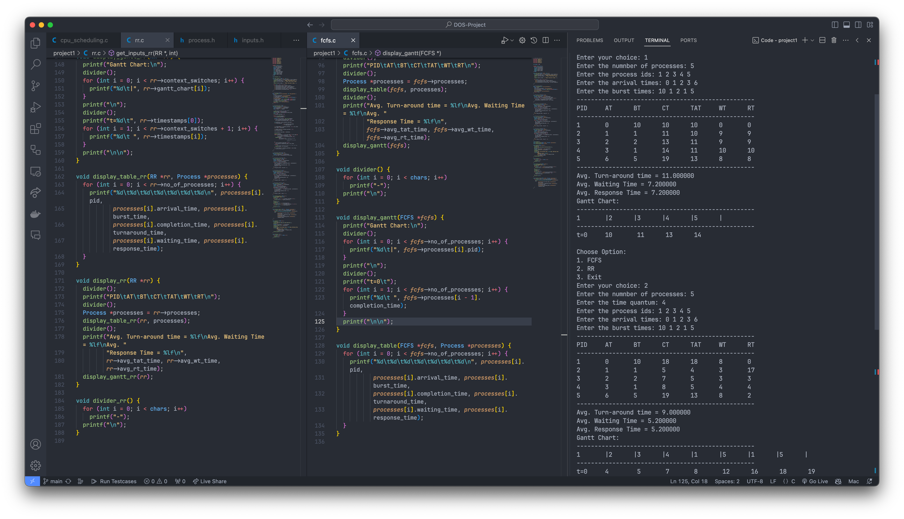
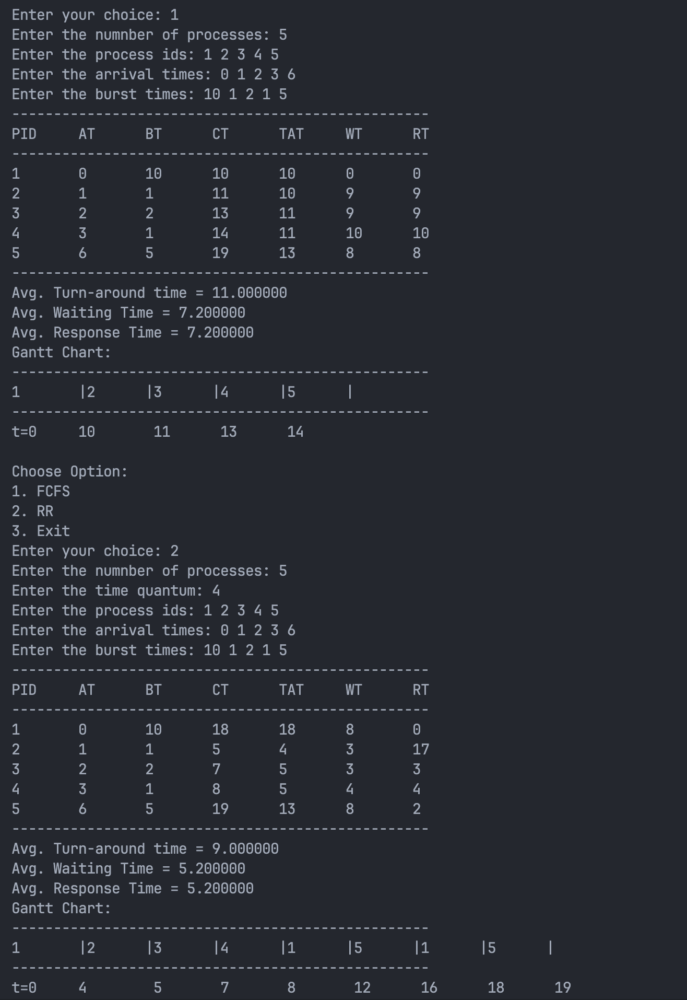

# Operating Systems Project

## CPU Scheduling Algorithms (Project 1)

- [Driver Code](./project1/cpu_scheduling.c)
- Usage: `gcc cpu_scheduling.c -o cpu_scheduling.out && ./cpu_scheduling.out`

### Algorithms Implemented

- [First Come First Serve](./project1/fcfs.c)
- [Round Robin](./project1/rr.c)
- 

### Results

- [Result](./project1/outputs//output.txt)
- 

## Banker's Algorithm (Project 2)
